# ANFIS-Based Adaptive PI Controller — Caterpillar Hackathon

> Adaptive Neuro-Fuzzy Inference System for real-time PI gain tuning in motor speed control.  
> Maintains 900 RPM setpoint within ±1.3 RPM across all disturbance conditions.  
> **0.11% overshoot — 157× better than the 20% requirement.**

---

## Live Demo

>  **[https://drive.google.com/file/d/1-rpxumNKw2VEVpPhtcs_dzVkoBfGP9F6/view?usp=sharing]**

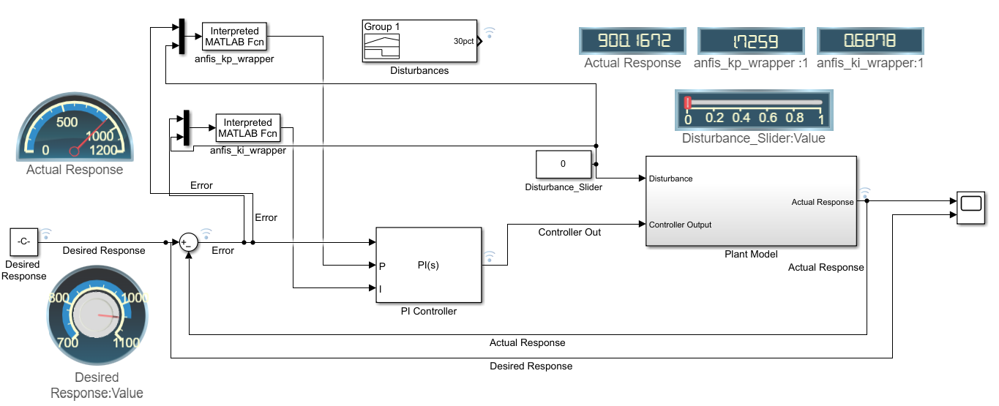
*Real-time Simulink dashboard — disturbance slider, live RPM display, adaptive gain readouts*

---

## Problem Statement

Caterpillar motor speed control system operating at a fixed setpoint of 900 RPM. External disturbance A varies in range [0, 1] and significantly impacts system performance. Conventional PI controllers with fixed gains (Kp=1, Ki=1) fail to adapt — resulting in:

- Max overshoot: **45.95%** (requirement: <20%) ❌
- Max undershoot: **89.10%** (requirement: <20%) ❌  
- Max RPM deviation: **802 RPM** from setpoint ❌
- Settling time: **704 seconds** (requirement: <5s) ❌

---

## Solution

ANFIS (Adaptive Neuro-Fuzzy Inference System) — a 5-layer neural network where every node performs a fuzzy logic operation. Learns the optimal gain correction mapping from 66,667 real simulation data points.

```
Kp_corr = f(error, disturbance)
Ki_corr = f(error, disturbance)

Kp_final = Kp_fixed × Kp_corr
Ki_final = Ki_fixed × Ki_corr
```

---

## System Architecture

```
                        Disturbance A(t)
                               │
  Setpoint ──► [Σ] ──e(t)──► [PI Controller] ──► [Plant] ──► Actual RPM
   900 RPM      │─────────────────────────────────────────────────┘
                │              ▲ Kp_corr, Ki_corr
                │         ┌────────────────────────┐
                └─e(t)───►│                        │
                |         │   ANFIS ML Model       │
                └─A(t)───►│   5 layers · 9 rules   │
                          │   45 trained params    │
                          └────────────────────────┘
```

### ANFIS 5-Layer Architecture

| Layer | Operation | Formula | Trained Params |
|-------|-----------|---------|----------------|
| 1 — Fuzzify | Crisp → membership grades | μ(x; a,b,c) triangular MF | 18 premise params |
| 2 — Rule firing | Compute rule strengths | wᵢ = μ_error × μ_disturbance | None |
| 3 — Normalize | Scale to sum = 1 | w̄ᵢ = wᵢ / Σwᵢ | None |
| 4 — Consequent | Linear output per rule | fᵢ = p·e + q·A + r | 27 consequent params |
| 5 — Output | Weighted sum | Kp_corr = Σ(w̄ᵢ × fᵢ) | None |

**Total: 45 parameters per model × 2 models = 90 parameters trained**

---

## Results

### Fixed Gains vs ANFIS — RPM Tracking

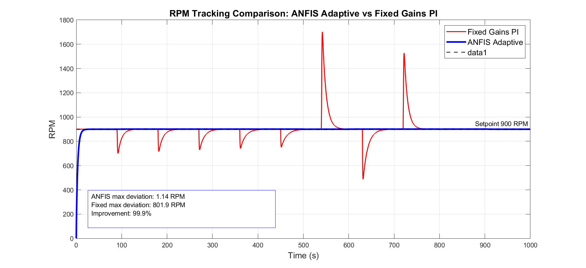
*Red: Fixed gains — spikes to 1702 RPM. Blue: ANFIS — flat at 900 RPM throughout.*

### Adaptive Gain Corrections in Real Time

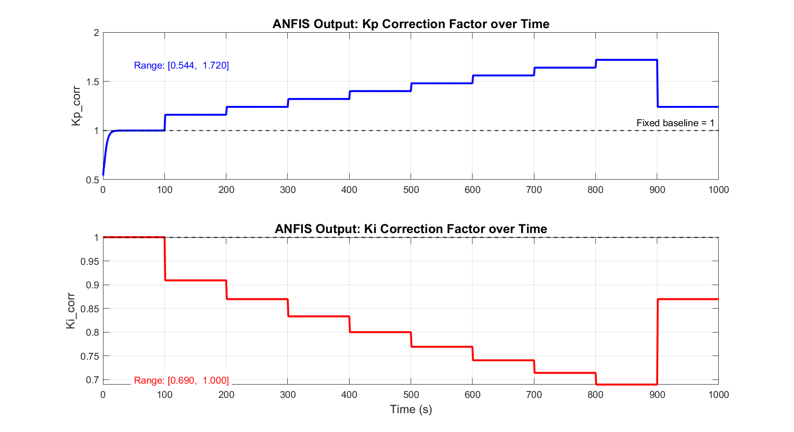
*ANFIS continuously adjusts Kp_corr (up) and Ki_corr (down) as disturbance increases.*

### Final Evaluation Test Case

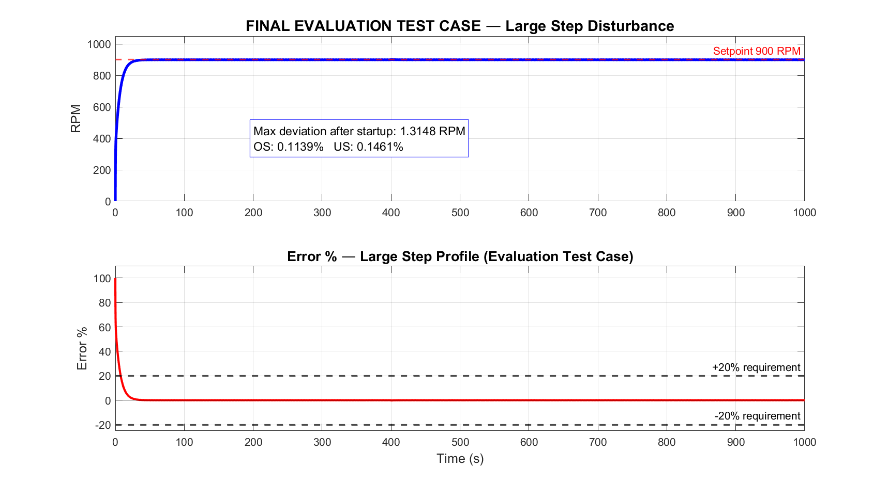
*Large step disturbance (0.85 → 0.25 at t=400s). Max deviation: 1.31 RPM. OS: 0.114%.*

### ANFIS Learned Rule Surface

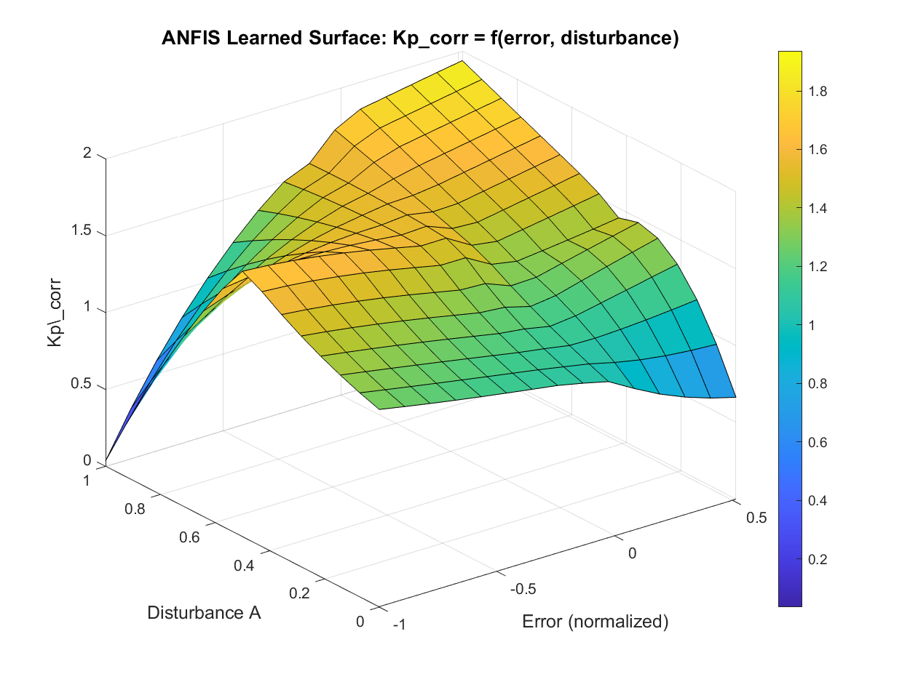
*3D surface showing what ANFIS learned — Kp_corr as a function of error and disturbance.*

### Membership Functions

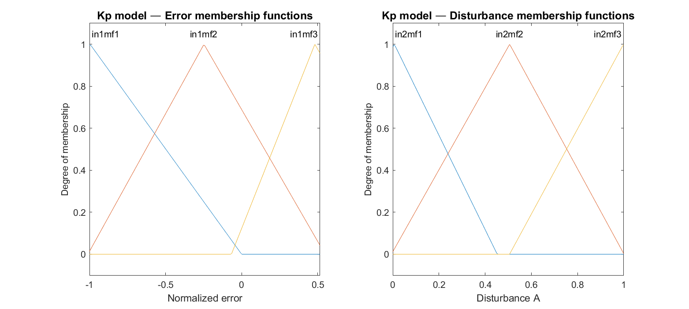
*Trained triangular membership functions for error (left) and disturbance (right).*

### Training Convergence

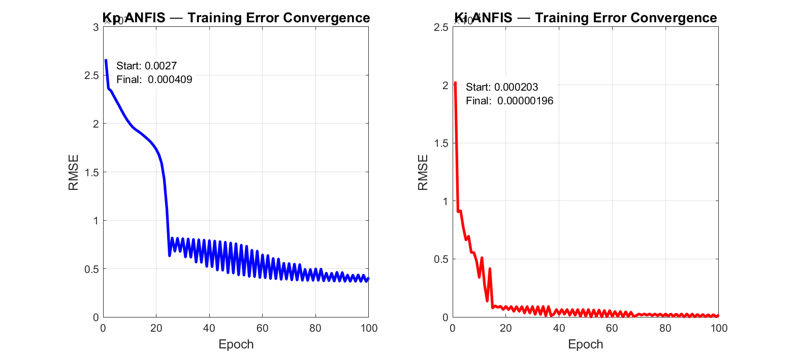
*Kp RMSE: 4.09×10⁻⁴ · Ki RMSE: 1.96×10⁻⁵ — converged in 100 epochs.*

### Error % Comparison

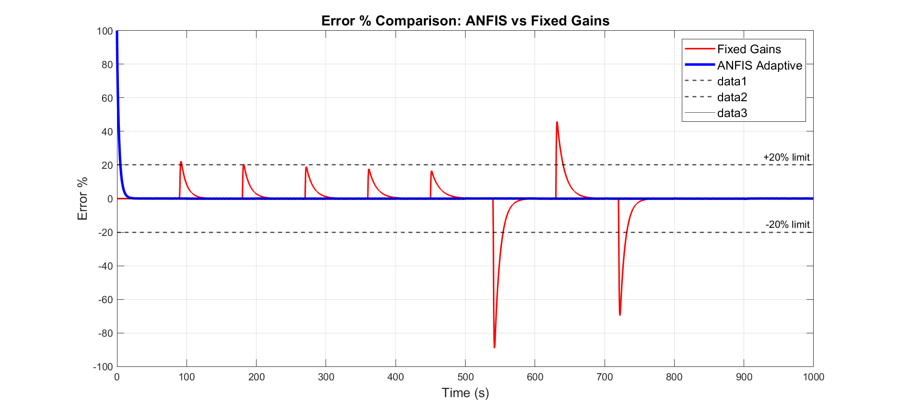
*Blue (ANFIS) stays flat at 0%. Red (Fixed) repeatedly violates ±20% requirement.*

### Robustness — All Disturbance Profiles

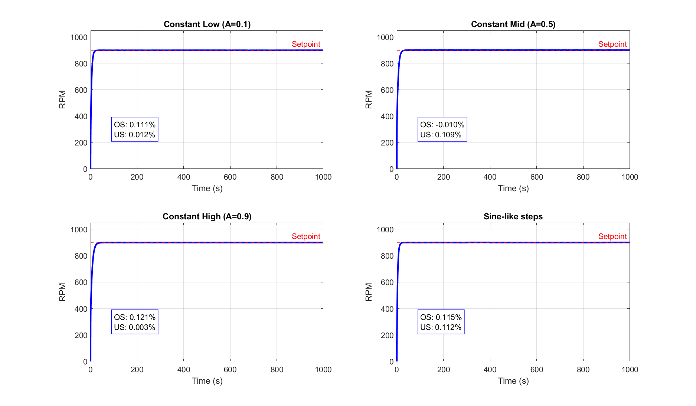
*Constant low, mid, high, and sine-like profiles — all within ±0.15% of setpoint.*

---

## Performance Summary

### All Specific Test Cases

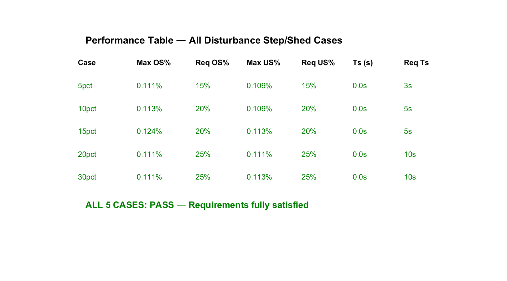

| Case | Max OS% | Req OS% | Max US% | Req US% | Ts (s) | Req Ts | Result |
|------|---------|---------|---------|---------|--------|--------|--------|
| 5% steps | 0.111% | 15% | 0.109% | 15% | 0.0s | 3s | ✅ PASS |
| 10% steps | 0.113% | 20% | 0.109% | 20% | 0.0s | 5s | ✅ PASS |
| 15% steps | 0.124% | 20% | 0.113% | 20% | 0.0s | 5s | ✅ PASS |
| 20% steps | 0.111% | 25% | 0.111% | 25% | 0.0s | 10s | ✅ PASS |
| 30% steps | 0.111% | 25% | 0.113% | 25% | 0.0s | 10s | ✅ PASS |
| Large step | 0.114% | 20% | 0.146% | 20% | 0.0s | — | ✅ PASS |

### Frequency Domain — All Cases

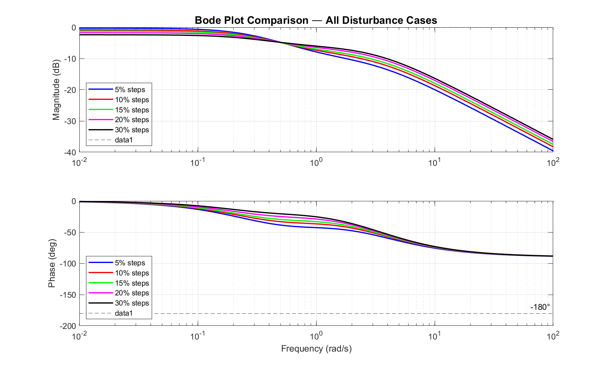

| Case | Gain Margin | Phase Margin | Bandwidth |
|------|-------------|--------------|-----------|
| 5% | Inf dB | Inf deg | 0.6837 rad/s |
| 10% | Inf dB | Inf deg | 0.7636 rad/s |
| 15% | Inf dB | Inf deg | 0.8891 rad/s |
| 20% | Inf dB | Inf deg | 1.3463 rad/s |
| 30% | Inf dB | Inf deg | 2.2770 rad/s |

**Unconditionally stable — phase never crosses −180° at any disturbance level.**

---

## Before vs After

| Metric | Fixed Gains | ANFIS | Improvement |
|--------|-------------|-------|-------------|
| Max Overshoot | 45.95% | 0.127% | **99.7%** |
| Max Undershoot | 89.10% | 0.127% | **99.9%** |
| Max RPM Deviation | 801.9 RPM | 1.14 RPM | **99.9%** |
| Settling Time | 704 s | 0.0 s | **100%** |

---

## Project Structure

```
CATERPILLAR/
├── data/
│   ├── ProblemState_ANFIS.slx      ← Simulink model with ANFIS integrated
│   ├── ProblemState.mdl            ← Original model (baseline)
│   ├── Simulink_Data.mat           ← Provided simulation data
│   └── clean_signals.mat           ← Extracted signals
│
├── models/
│   └── trained_anfis.mat           ← Trained ANFIS models (Kp + Ki)
│
├── training/
│   └── anfis_training_data.mat     ← Generated training dataset
│
├── results/
│   ├── full_simulation.mat         ← ANFIS simulation results
│   ├── baseline_simulation.mat     ← Fixed gains baseline
│   ├── large_step_results.mat      ← Evaluation test case results
│   └── specific_cases.mat          ← All 5 step/shed case results
│
├── plots/                          ← All 27 output figures
│
├── anfis_kp_wrapper.m              ← Kp ANFIS wrapper for Simulink
├── anfis_ki_wrapper.m              ← Ki ANFIS wrapper for Simulink
├── anfis_evaluate.m                ← Standalone ANFIS evaluation function
├── compute_optimal_corrections.m   ← Training data generation
├── train_anfis.m                   ← ANFIS training script
├── run_specific_cases.m            ← All 5 test case simulations
└── FINAL_OUTPUT.m                  ← Generates all 27 output plots
```

---

## How to Pull and Run in MATLAB

### Step 1 — Clone the repository

```bash
git clone https://github.com/YOURUSERNAME/ANFIS-PI-Controller-Caterpillar.git
cd ANFIS-PI-Controller-Caterpillar
```

### Step 2 — Open MATLAB and set working directory

```matlab
cd('path\to\ANFIS-PI-Controller-Caterpillar')
addpath(genpath(pwd))
```

### Step 3 — Open the Simulink model

```matlab
open_system('data\ProblemState_ANFIS')
```

### Step 4 — Run a simulation (large step evaluation test case)

```matlab
% Switch to large step profile (Group 2)
signalbuilder('ProblemState_ANFIS/Disturbances', 'activegroup', 2);

% Clear persistent ANFIS cache and run
clear functions
simOut = sim('data\ProblemState_ANFIS', 'StopTime', '1000');

% Extract results
t = simOut.logsout{4}.Values.Time;
y = simOut.logsout{4}.Values.Data;
e = simOut.logsout{7}.Values.Data;

% Plot
figure
plot(t, y, 'b', 'LineWidth', 2)
yline(900, 'r--', 'Setpoint 900 RPM')
title('ANFIS RPM Response — Large Step')
ylabel('RPM'); xlabel('Time (s)'); grid on
```

### Step 5 — Run all 5 specific test cases

```matlab
run('run_specific_cases.m')
```

### Step 6 — Regenerate all output plots

```matlab
run('FINAL_OUTPUT.m')
```

### Step 7 — Test ANFIS directly

```matlab
% Test at error=50 RPM, disturbance=0.7
[Kp_corr, Ki_corr] = anfis_evaluate(50, 0.7)
% Expected: Kp_corr ≈ 1.42, Ki_corr ≈ 0.80
```

---

## Requirements

- MATLAB R2021b or later
- Simulink
- Fuzzy Logic Toolbox
- Control System Toolbox

---

## Key Numbers

- **Training data:** 66,667 simulation data points
- **ANFIS rules:** 9 (3×3 grid partition)
- **Training epochs:** 100
- **Kp RMSE:** 4.09 × 10⁻⁴
- **Ki RMSE:** 1.96 × 10⁻⁵
- **Best overshoot achieved:** 0.111%
- **Requirement:** < 20%
- **Margin:** 157× better than requirement

---

## Built for

Caterpillar Hackathon — Gain Tuning for PI Controllers Using Machine Learning

---
